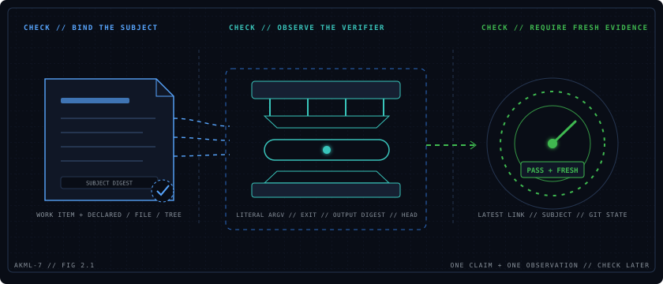

<p align="center">
  
</p>

# Cuff

**Make claims checkable. Reject evidence when stale.**

Cuff ties one completion claim to one exact subject, runs the verifier you
choose, and checks whether the latest passing evidence still matches the
current Git state.

It turns a completion statement into a durable, checkable record without
deciding what should prove the work or what action should follow.

## Requirements

- Python 3.11 or newer;
- `uv` on `PATH` (`0.11.32` is the tested recommendation); and
- an existing Git worktree. Its root is the only valid Cuff workspace.

Git is mandatory. Cuff never initializes a repository, selects another
worktree, or stages, commits, fetches, pushes, releases, or deploys anything.

## Install

Install a released version as a standard uv-managed tool:

```bash
uv tool install cuff-cli==0.1.0
cuff --version
```

For local development, install the checkout explicitly:

```bash
uv tool install --editable .
```

Cuff has no runtime dependencies. It is distributed as a standard wheel and
source distribution; it contains no bundled Python or native executable.

## Five-command quickstart

Run initialization at the exact Git worktree root:

```bash
cuff init --json
git add .cuff/project.json
git commit -m "Initialize Cuff"
```

The marker is exactly `{"schema":1}` and records live under
`.cuff/records/`. An incompatible marker is never rewritten or migrated.

The preferred path atomically appends a claim and its observed evidence:

```bash
cuff seal \
  --work-item task-1 \
  --summary "Implementation complete" \
  --subject-path src \
  --json \
  -- python -m pytest

cuff check --work-item task-1 --json
```

The split path is available when the claim must exist before verification:

```bash
cuff claim \
  --work-item task-1 \
  --summary "Implementation complete" \
  --subject-path src \
  --json

cuff verify \
  --work-item task-1 \
  --claim rec_REPLACE_ME \
  --json \
  -- python -m pytest
```

The public surface is exactly:

```text
cuff init
cuff claim
cuff verify
cuff seal
cuff check
```

Every claim, verification, seal, and check names its work item explicitly.
Declared subjects use the complete `{kind, ref, digest}` identity; file and
tree subjects use `--subject-path` and a Cuff-computed manifest digest.

## Proof boundary

- Claims and evidence are closed generation-1 JSONL records.
- Every evidence record contains the `HEAD` commit observed before execution.
- Verifier argv is executed literally without a shell.
- Non-ledger dirtiness before or after verification records no evidence.
- `seal` appends its linked pair in one locked atomic replacement.
- `check` enforces subject freshness, commit ancestry, changed paths,
  non-ledger cleanliness, and append-only ledger changes.

Cuff treats verifier argv as opaque. It does not select the command, import an
extension, interpret domain output, or grant merge, release, deployment,
spend, or residual-risk authority.

## Static host integrations

Small native assets live in [`plugins/claude/cuff`](plugins/claude/cuff) and
[`plugins/codex/cuff`](plugins/codex/cuff). The corresponding host plugin
manager owns their installation and removal. These assets require only the
uv-managed `cuff` executable on `PATH`; Cuff itself does not install plugins.

```bash
# Codex
codex plugin marketplace add fab7hq/cuff --ref v0.1.0
codex plugin add cuff@fab7hq

# Claude Code
claude plugin marketplace add fab7hq/cuff@v0.1.0
claude plugin install cuff@fab7hq --scope user
```

See [RUNBOOK.md](RUNBOOK.md) for operations, [the architecture overview](docs/architecture/overview.md)
for ownership, and [the ledger contract](docs/architecture/ledger.md) for the
record and gate invariants.

## Development

```bash
uv sync --locked
uv run --locked python -m pytest
uv run --locked python -m compileall -q core/cuff
uv build
git diff --check
```

## Community and support

- Use [Cuff Discussions](https://github.com/fab7hq/cuff/discussions) for usage questions and design proposals.
- Report reproducible defects through [GitHub Issues](https://github.com/fab7hq/cuff/issues/new/choose).
- Read [CONTRIBUTING.md](CONTRIBUTING.md) before proposing a change.
- Report vulnerabilities privately as described in [SECURITY.md](SECURITY.md).

Cuff is licensed under the [Apache License 2.0](LICENSE).
